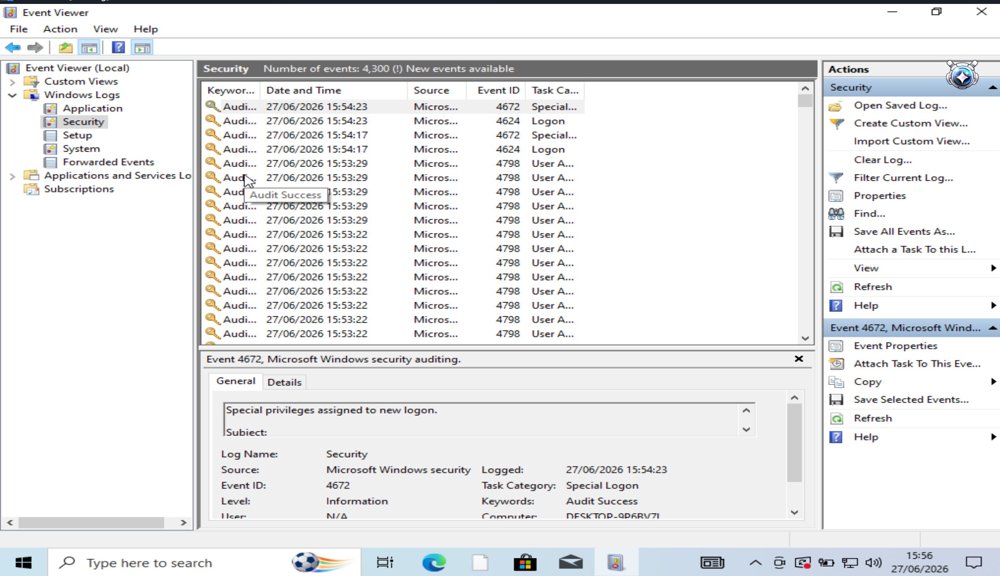
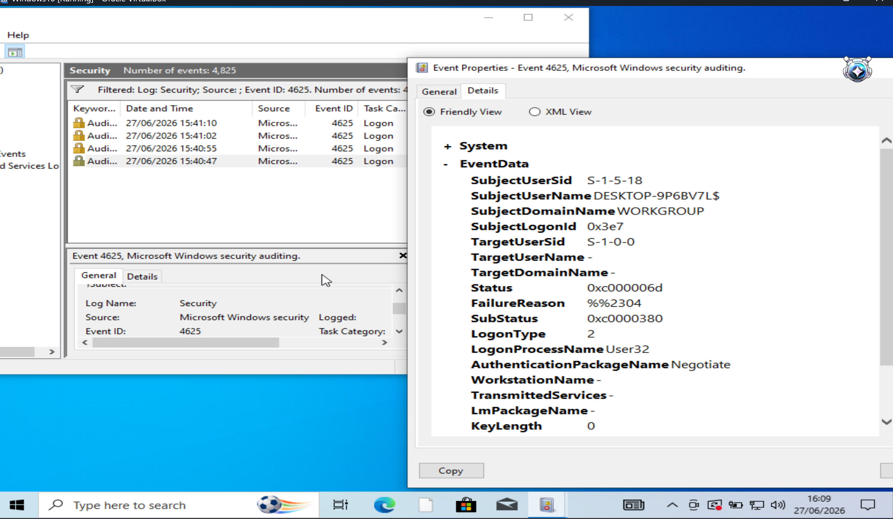
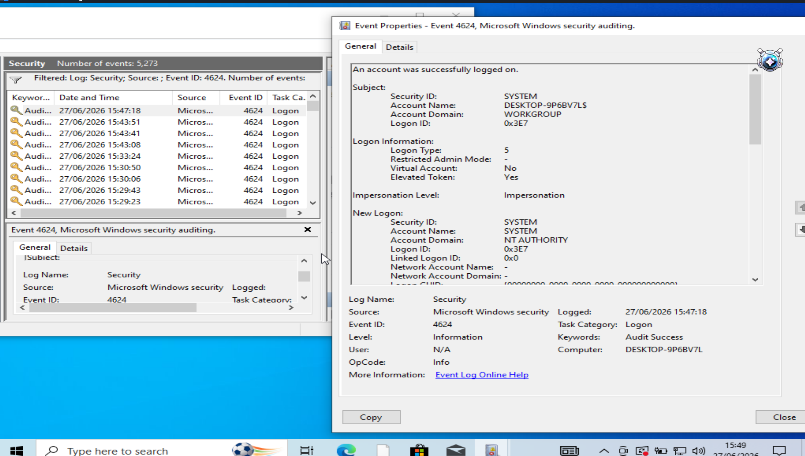
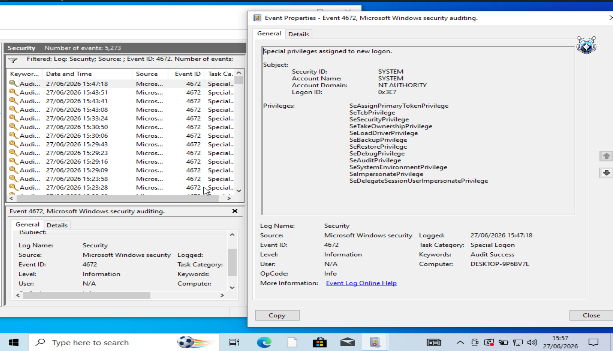
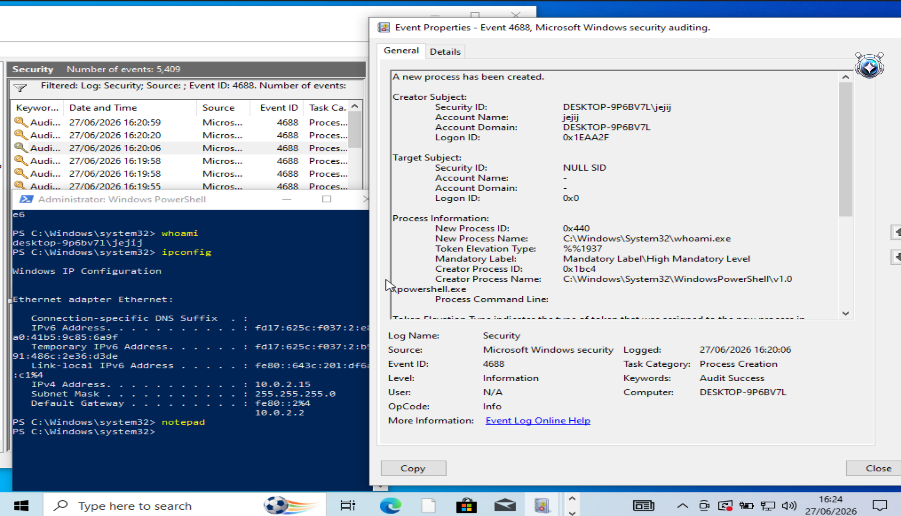
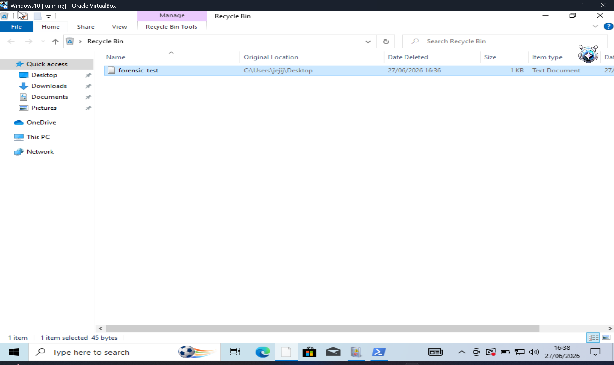
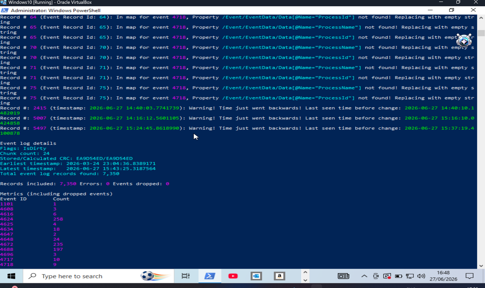
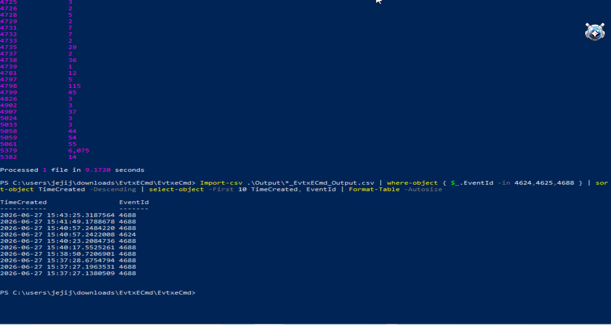
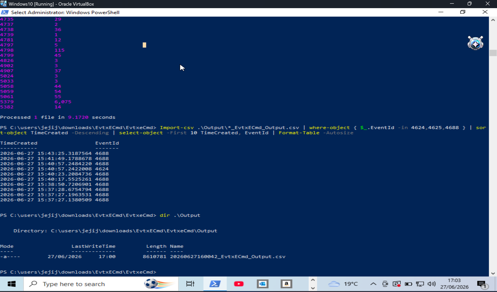

# Lab 4 — Digital Forensic Investigation Using Windows Security Event Logs

> **Series:** Blue Team Build Log | **Difficulty:** Beginner–Intermediate  
> **Tools:** Event Viewer · PowerShell · EvtxECmd · Windows 10 VM · VirtualBox

---

## Overview

This lab focuses on performing a hands-on digital forensic investigation on a Windows 10 virtual machine. Using built-in Windows tools and the open-source forensic utility **EvtxECmd**, the goal was to analyse Windows Security Event Logs to detect suspicious login behaviour, track command execution, investigate deleted files, and extract evidence automatically.

This lab covers the core skills used by **SOC Analysts** and **Digital Forensic Investigators** during real-world incident response.

---

## Objectives

- Navigate and filter Windows Security Event Logs using Event Viewer
- Identify and interpret key security Event IDs (4624, 4625, 4672, 4688)
- Enable process creation auditing using `auditpol`
- Track command execution via Event ID 4688
- Investigate deleted file artifacts using the Windows Recycle Bin
- Extract and parse Security logs at scale using EvtxECmd

---

## Lab Environment

| Component | Details |
|-----------|---------|
| **Host OS** | Windows (VirtualBox host) |
| **VM** | Windows 10 64-bit |
| **RAM** | 4 GB |
| **Tools** | Event Viewer, PowerShell, EvtxECmd 2026.5.0 |
| **Cost** | 100% Free |

---

## Key Event IDs Investigated

| Event ID | Description | Forensic Significance |
|----------|-------------|----------------------|
| **4624** | Successful login | Confirms account access |
| **4625** | Failed login attempt | Repeated failures = brute-force indicator |
| **4672** | Special privileges assigned | Detects privilege escalation |
| **4688** | New process created | Tracks command and program execution |

---

## Steps Completed

### Step 1 — Open Event Viewer and Navigate to Security Logs
- Opened Event Viewer via `Win + R` → `eventvwr`
- Navigated to **Windows Logs → Security**

### Step 2 — Detect Failed Login Attempts (Event ID 4625)
- Filtered Security log for Event ID **4625**
- Identified failed login entries with **LogonType 2** (interactive keyboard login)
- Key fields: `TargetUserName`, `FailureReason`, `LogonType`

### Step 3 — Identify Successful Login Events (Event ID 4624)
- Filtered for Event ID **4624**
- Found **258 successful login events** including LogonType 5 (service logins) and LogonType 2 (interactive)
- Key fields: `TargetUserName`, `LogonType`, `ProcessName`

### Step 4 — Detect Privilege Escalation (Event ID 4672)
- Filtered for Event ID **4672**
- Observed **235 privilege assignment events** for the SYSTEM account
- Privileges identified: `SeDebugPrivilege`, `SeBackupPrivilege`, `SeTakeOwnershipPrivilege`, `SeImpersonatePrivilege`

### Step 5 — Enable Process Creation Auditing
- Ran in PowerShell (Administrator):
```powershell
auditpol /set /subcategory:"Process Creation" /success:enable
```
- Confirmed: `The command was successfully executed.`

### Step 6 — Track Command Execution (Event ID 4688)
- Executed test commands in PowerShell:
```powershell
whoami
ipconfig
notepad
```
- Located corresponding Event ID **4688** entries in Security log
- Confirmed forensic trail: who ran it, what was run, from which process, at what time

### Step 7 — Investigate Deleted File (Recycle Bin Artifact)
- Created file: `forensic_test.txt` on Desktop
- Deleted the file and opened Recycle Bin
- Recovered forensic metadata:

| Field | Value |
|-------|-------|
| Original Location | `C:\Users\jejij\Desktop` |
| Date Deleted | 27/06/2026 16:36 |
| Size | 1 KB |

### Step 8 — Automated Log Extraction with EvtxECmd
- Downloaded EvtxECmd from [Eric Zimmerman's Tools](https://ericzimmerman.github.io/#!index.md)
- Copied live Security log (required — Windows protects the live file):
```powershell
Copy-Item C:\Windows\System32\winevt\Logs\Security.evtx C:\Users\jejij\Downloads\Security.evtx
```
- Extracted to CSV:
```powershell
.\EvtxECmd.exe -f C:\Users\jejij\Downloads\Security.evtx --csv Output
```
- Filtered key events from CSV:
```powershell
Import-Csv .\Output\*_EvtxECmd_Output.csv | Where-Object { $_.EventId -in 4624,4625,4688 } | Sort-Object TimeCreated -Descending | Select-Object -First 10 TimeCreated, EventId | Format-Table -AutoSize
```

### Results

| Event ID | Count | Meaning |
|----------|-------|---------|
| 4624 | 258 | Successful logins |
| 4625 | 4 | Failed login attempts |
| 4672 | 235 | Privilege assignments |
| 4688 | 197 | Process creation events |

**Total records processed: 7,350 | Errors: 0 | Events dropped: 0**

---

## Key Takeaways

- Windows Security Event Logs are a primary source of forensic evidence during incident response
- Event IDs 4624, 4625, 4672, and 4688 are the four most critical for detecting suspicious activity
- Repeated 4625 events followed by a 4624 is the classic signature of a brute-force attack
- Event ID 4688 must be manually enabled via `auditpol` — it is off by default
- The Recycle Bin preserves file metadata even after deletion — a valuable forensic artifact
- EvtxECmd converts thousands of raw log entries into structured, searchable CSV data

---

## Screenshots

### 01 — Event Viewer open on Security log


### 02 — Failed login attempts (Event ID 4625)


### 03 — Successful login event (Event ID 4624)


### 04 — Privilege assignment (Event ID 4672)


### 05 — Process creation auditing enabled via auditpol


### 06 — Command execution tracked via Event ID 4688


### 07 — Deleted file artifact in Recycle Bin


### 08 — EvtxECmd processing Security log (7,350 records)


### 09 — Filtered events from CSV via PowerShell


### 10 — CSV output file confirmed


---

## Tools Used

| Tool | Purpose | Link |
|------|---------|------|
| **Event Viewer** | Manual log investigation | Built-in Windows |
| **PowerShell** | Command execution and log filtering | Built-in Windows |
| **EvtxECmd** | Automated EVTX log parsing to CSV | [Eric Zimmerman Tools](https://ericzimmerman.github.io/#!index.md) |
| **VirtualBox** | VM environment | [virtualbox.org](https://www.virtualbox.org) |

---

## Blog Post

Full write-up published on CyberTrail (Hashnode):  
🔗 https://hashnode.com/@jeji-james

---


