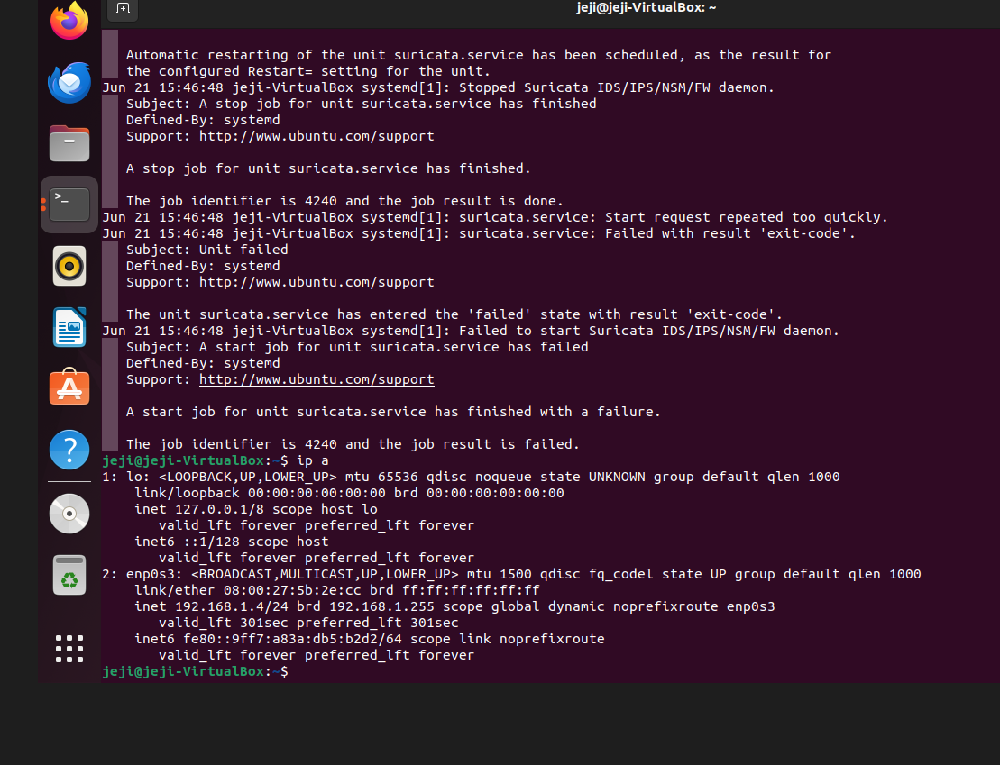
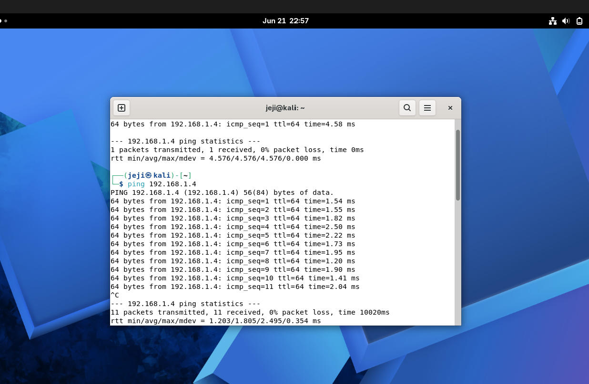
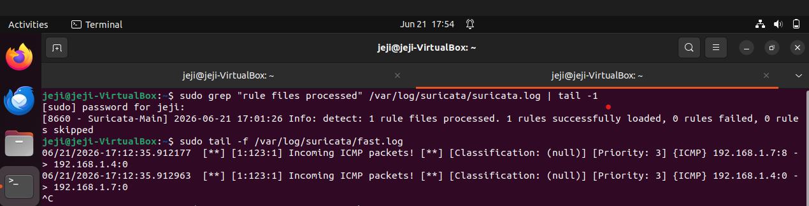

# Lab 5 — Suricata IDS: ICMP Detection

**Series:** Blue Team Build Log  
**Platform:** Ubuntu (VirtualBox) + Kali Linux  
**Tools:** Suricata 8.0.5, nano, terminal  
**Skill level:** Entry-level SOC / Network Defense

---

## Objective

Install and configure **Suricata IDS** on Ubuntu, write a custom ICMP detection rule, generate attack traffic from a Kali Linux VM, and confirm detection via Suricata's alert log in real time.

---

## Environment

| Role | Machine |
|---|---|
| IDS Sensor / Target | Ubuntu (VirtualBox), IP: `192.168.1.4` |
| Attacker | Kali Linux (VirtualBox), IP: `192.168.1.7` |
| Network | Both VMs on same NAT Network |

---

## Key Steps

1. Installed Suricata via OISF PPA (`ppa:oisf/suricata-stable`)
2. Backed up default config before editing (`suricata.yaml.backup`)
3. Configured `HOME_NET` and capture interface (`enp0s3`) to match the VM environment
4. Created custom rule file at `/var/lib/suricata/rules/custom.rules`
5. Wrote ICMP detection rule:
   ```
   alert icmp any any -> $HOME_NET any (msg:"Incoming ICMP packets!"; sid:123; rev:1;)
   ```
6. Started Suricata in live capture mode and tailed `fast.log`
7. Pinged Ubuntu from Kali — alerts appeared in real time

---

## Result

Suricata detected and logged ICMP traffic immediately upon ping:

```
06/21/2026-17:12:35  [**] [1:123:1] Incoming ICMP packets! [**] [Priority: 3] {ICMP} 192.168.1.7 -> 192.168.1.4
06/21/2026-17:12:35  [**] [1:123:1] Incoming ICMP packets! [**] [Priority: 3] {ICMP} 192.168.1.4 -> 192.168.1.7
```

Two alert lines per ping cycle — the rule matched both the incoming request and the outbound reply, since both IPs fall within `HOME_NET` (`192.168.1.0/24`).

---

## Key Troubleshooting

| Problem | Cause | Fix |
|---|---|---|
| `systemctl status suricata` → failed | Default config used `eth0`; actual interface was `enp0s3` | Updated `af-packet: interface` in `suricata.yaml` |
| `No rules were loaded` | `rule-files` section referenced `suricata.rules` (non-existent) | Changed to `custom.rules` in `suricata.yaml` |
| `conf-yaml-loader: Invalid config file` | YAML header (`%YAML 1.1 / ---`) was corrupted during editing | Restored header lines at top of file in nano |

---

## Screenshots

### 1. System IP & Interface Discovery
`ip a` output confirming real interface name `enp0s3` and Ubuntu IP `192.168.1.4` — used to fix the default config which assumed `eth0`.



---

### 2. Kali Linux Ping (Attack Traffic)
Sustained ping from Kali (`192.168.1.7`) to Ubuntu (`192.168.1.4`) — 11 packets sent, 0% packet loss, confirming network connectivity between the two VMs.



---

### 3. Suricata Alert — Detection Confirmed
`fast.log` showing live `Incoming ICMP packets!` alerts firing in real time as ping packets arrived. Also confirms `1 rules successfully loaded` from `custom.rules`.



---

## What I Learned

- How Suricata processes packets using AF_PACKET and matches them against signatures
- How `HOME_NET` scoping affects which traffic triggers a rule — both the ping request and reply fired the alert since both IPs were inside `192.168.1.0/24`
- How to trace IDS startup failures using the right log file (`suricata.log`, not `journalctl`)
- The difference between running Suricata as a systemd service vs. manually in the foreground

---

## Related

- 📝 Full blog post: [CyberTrail — Blue Team Build Log](https://hashnode.com/@jeji-james)
- 🔗 Series: Blue Team Build Log
